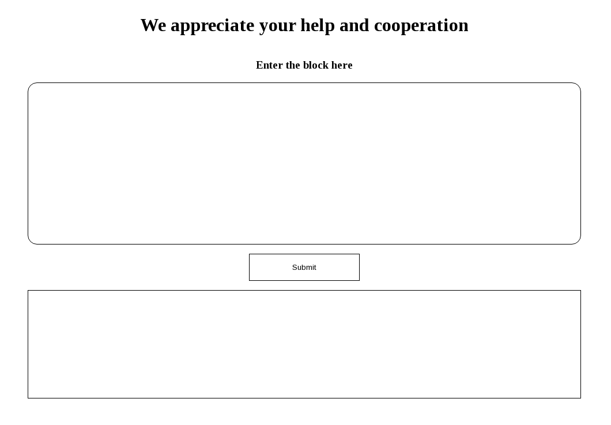
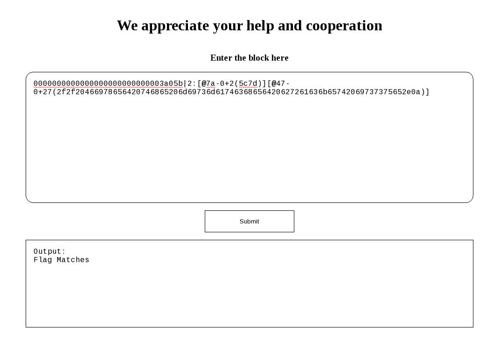
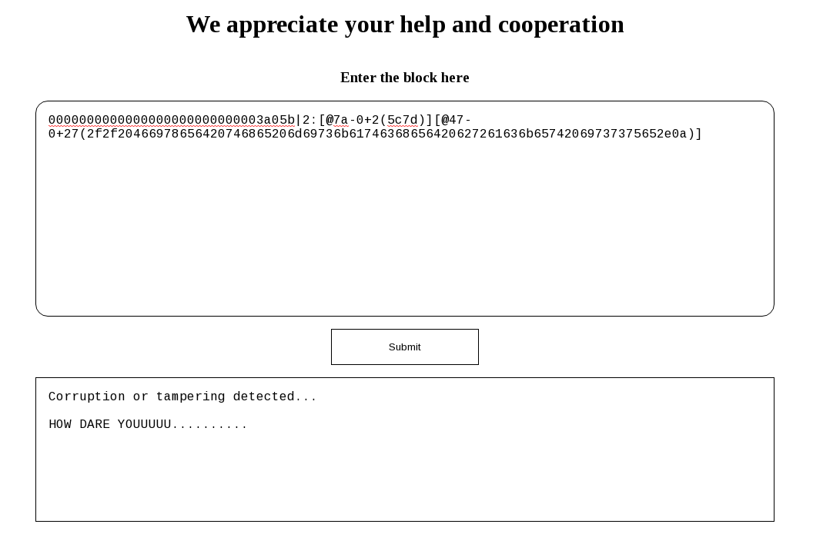
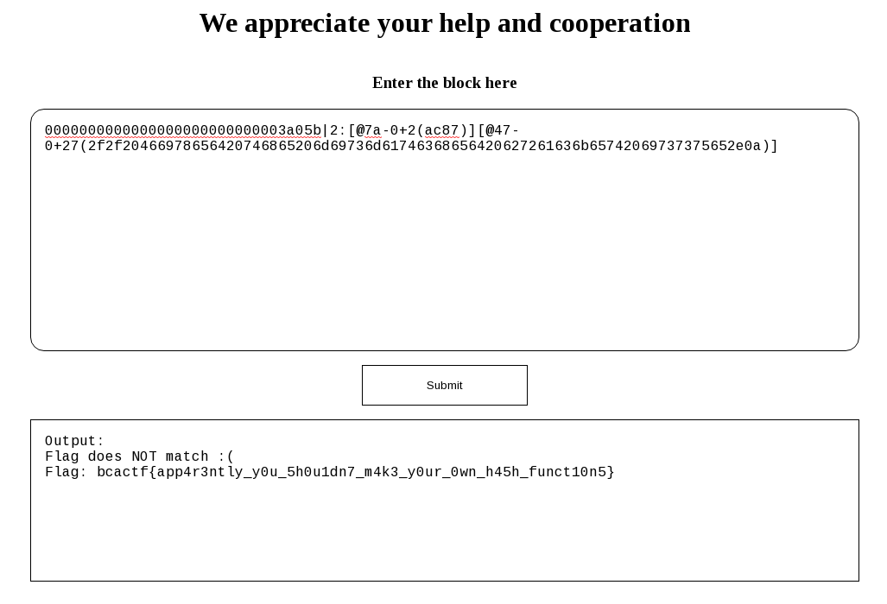

# Git Better

tags: #crypto #rev
points: 200

## Description

We at BCACTF aspire to be unique.
~me
That's why we decided to use our own ✨proprietary✨ VCS for this year's challenges. It's a new and more efficient1 way to manage challenge versions, using The Blockchain™.

If you're a cryptocurrency person though, this chain of blocks may disappoint you. But we here at BCACTF aspire to be unique, (see above,) and so we will do what we want and NOT what the users want.

Either way, we have a bit of an embarrassing situation on our hands. We just built our new flag validator, and in the process of copying the repository to the production server, we ran into a little issue... and lost one of our blocks.

So would you uh... be willing to copy that over? I'm on vacation, and you seem to be a part of the new workplace family, so I'm sure you'd be happy to help us out, right?

So would you be willing to copy over this block archive to the server? If you do that, I'd even give you ✨exclusive✨ access to the proprietary repository protocols.

Just please don't tamper with it, okay? Actually, I don't trust you. Blockchains are immutable for security purposes.

Now go get that second block in, okay?

Author: **skysky**

### Resources

[challs.bcactf.com:31499](challs.bcactf.com:31499)
[git_better.tar](./git_better.tar)
[lost_block.txt](./lost_block.txt)


## Solution

The challange takes us to a webpage that looks like this:



As we can see, we were given a portal so that we can submit the block that was lost. We were also given the lost block. This is the output when we submit the lost block.



Now let's try to understand what the server does.

We were given a tarball of the server:

chall_tar/
├── base
│   ├── block.ts
│   ├── hashing.ts
│   └── repository.ts
└── server
    ├── index.html
    └── index.ts

### The server

The basic functionality of the html is as follows:

```html
<div class="main">
    <h1>We appreciate your help and cooperation</h1>
    <h3>Enter the block here</h3>
    <textarea id="block-input" class="input"></textarea>
    <button onmousedown="requestResponse()" class="submit-button">Submit</button>
    <div id="output" class="output-area" />
</div>
```

As we can see the page takes `block-input` as input and sends to the server.


There are many things going on in the server side for handling the post request as we can see from this part of `server.ts` file.

```ts
server.post(
    "/submit",
    async (req, res) => {
        const body = req.body;
        if (typeof body !== "string") {
            res.status(400).send("Bad Body");
            return;
        }
        console.log("Submit req recieved with body:", body.slice(0, 1024));

        const buffer = Buffer.from(body);
        const block = bufToBlock(buffer);

        if (!block) {
            res.status(400).send("Malformed Block");
            return;
        }

        const repo = fromBlocks([
            bufToBlock(Buffer.from(recievedBlocks[0][1]))!,
            block,
            bufToBlock(Buffer.from(recievedBlocks[1][1]))!,
            bufToBlock(Buffer.from(recievedBlocks[2][1]))!,
        ]);

        const output = build(repo);
        if (!output) {
            res.status(400).send("Corruption or tampering detected...\n\nHOW DARE YOUUUUU..........");
            return;
        }

        const controller = spawn("deno", ["run", "--allow-read=./flag.txt", "-"]);

        controller.stdin.write(output.toString("ascii") + "\n");
        controller.stdin.end();

        controller.stderr.pipe(process.stderr, { end: false });

        res.write("Output:\n");
        controller.stdout.pipe(res);
    }

)
```

The server follows the following algorithm:

- Recieve the post input from the request as a buffer.
- Create a block out of it.
- Create a repository from the blocks and the input block as the second block.
    > We also see a predifined array of blocks named `recievedBlocks` of size 3.
    > These are the blocks that the server already has and the lost block is the one that they lost.
- Build the repo.
- Run the repo as a deno script.
    > This script is supposedly their flag validator.
- Send the output of the script run as the response.

The webpage loads the response into the bottom textbox where we see the output for providing the lost block is `Flag Matches`. So the flag validator works as expected for the right input.

Let's see if it can detect if we corrupted the lost block.



As we can see, it can indeed detect if we corrupted the lost block.

Let's understand how the `build(repo)` function works.

```ts
export const build = (repo: Repository): Buffer | null => {
    const listOfBlocksToExecute = [];
    let currBlock = repo.mostRecent;

    while (currBlock !== 0n) {
        const data = repo.blocks.get(currBlock);
        if (!data) return null;

        const block = bufToBlock(Buffer.from(data));
        if (!block) return null;

        listOfBlocksToExecute.unshift(block);
        currBlock = block.prevHash;
    }

    const array = listOfBlocksToExecute.reduce((curr, block) => execBlock(curr, block), [] as number[]);

    return Buffer.from(array);
};
```

The function takes in a `Repository` type as a parameter and returns an array buffer after executing all the blocks. So, the blocks are units of execution and repository is a collection of blocks.

The `Repository` is defined like below:

```ts
interface Repository {
    blocks: Map<bigint, string>;
    mostRecent: bigint;
}
```

The collection of blocks is a map that maps a bigint to a string. The bigint being the hash of the string i.e. the block buffer. `mostRecent` is a tracker to the most recent block recieved. We can see in the build function that a list of blocks to execute is being made with the most recent block as the first block. Also, each block contains a hash of the previous block which is used to create the list.

Now let's see how a block is defined.

```ts
export interface Block {
    prevHash: bigint;
    changes: Change[];
}
```

Also let's see how a change is defined.

```ts
export interface Change {
    index: number;
    remove: number;
    insert: Uint8Array;
}
```

After seeing a conversion from block to buffer or buffer to block function, it becomes clear how a string is converted to a block and verified.

The server uses a custom hash function to generate a hash for the blocks. the custom hash function is as follows:

```ts
export let modPrime = 261557n;
export let powerPrime = 1933n;

export const setSpecialPrime = (n: bigint) => modPrime = n;
export const setPowerPrime = (n: bigint) => powerPrime = n;


const myHashFunction = (data: Buffer) => {
    let currentHash: bigint = 0n;

    for (let i = 0n; i < data.byteLength; i++) {
        const byte = data[Number(i)];

        currentHash ^= (powerPrime ** BigInt(byte) * i) % modPrime;
    }

    return currentHash;
};

export default myHashFunction;

```

We can see that the `modPrime` despite being a bigint is actually a very small number. So the `myHashFunction` is vulnerable to simple brute-force attack. Now we know we can modify the `lost_block` and can still get the script to execute.

But before all that, as we now have the full understanding of how everything works, let's build the original flag checker repo from the right blocks.

```ts

import {readFileSync as readFile} from 'node:fs';

const filePath = "./flag.txt";
// Actually read the flag file.
const fileData = readFile(filePath, "utf8");

// Fixed the mismatched bracket issue.
const flagValidatorRegex = /bcactf\\{[a-zA-Z0-9_\\-]\\}/;

if (fileData.trim().match(flagValidatorRegex)) {
    console.log("Flag Matches");
} else {
    console.log("Flag does NOT match :(");
    console.log("Flag:", fileData);
}
```

So, We will only be able to get the flag if the flag does not match the regex. We can corrupt the regex as we can modify the lost_block.

All we need to do now is to write a brute-force to create a block that will give the same hash.

The following python function does the job:

```python
#!/usr/bin/env python

mod_prime = 261557
power_prime = 1933


def my_hash_function(data):
    current_hash = 0

    for i in range(len(data)):
        byte = ord(data[i])

        current_hash ^= (power_prime ** byte * i) % mod_prime

    return current_hash


buf = '0000000000000000000000000003a05b|2:[@7a-0+2(5c7d)][@47-0+27(2f2f20466978656420746865206d69736d61746368656420627261636b65742069737375652e0a)]'
hash = my_hash_function(buf)

for i in range(0xffff):
    new_buf = f'0000000000000000000000000003a05b|2:[@7a-0+2({hex(i)[2:]})][@47-0+27(2f2f20466978656420746865206d69736d61746368656420627261636b65742069737375652e0a)]'
    new_hash = my_hash_function(new_buf)
    if new_buf != buf and new_hash == hash:
        buf = new_buf
        print(new_buf)
        print(new_hash)
        exit()
```

The output:

```
0000000000000000000000000003a05b|2:[@7a-0+2(ac87)][@47-0+27(2f2f20466978656420746865206d69736d61746368656420627261636b65742069737375652e0a)]
```

Submit the block and get the flag



> Note: `Git Even Better` uses a large prime as the modPrime. There is another way to get a hash collision but that has to do with cryptography. Apparantly the hashing algorithm is also vulnerable to some degree.


