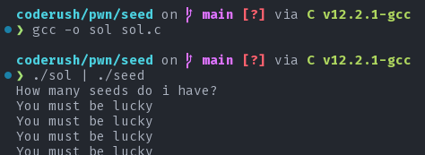

# Seed

#### tags: `binexp` `random`

## Description

Let's play a game where I guess a number and you tell what it is.
If you can correctly tell me what my guess is I will give you my precious flag.

`nc 139.59.0.163 5336`

**flag format:** `coderush{fl4g}`

>Author: `gr007`Let's play a game where I guess a number and you tell what it is.

[seed](seed)

## Solution

We are given a binary seed file. Let's load it up with Ghidra.

<details>
    <Summary>Ghidra witchery</Summery>

    ```c
    int main(void)
    {
        uint __seed;
        int r;
        long in_FS_OFFSET;
        int input;
        int i;
        FILE *file;
        char flag [72];
        long local_10;

        local_10 = *(in_FS_OFFSET + 40);
        __seed = rand();
        srand(__seed);
        puts("How many seeds do i have?");
        for (i = 0; i < 100; i += 1) {
            __isoc99_scanf(&PTR_DAT_00102022,&input);
            r = rand();
            if (r % 100000 != input) {
                puts(&PTR_DAT_00102022 + 3);
                        /* WARNING: Subroutine does not return */
                exit(0);
            }
            puts("You must be lucky");
        }
        file = fopen("flag.txt","r");
        if (file == NULL) {
            puts("flag not found.");
            puts("If you are running this on the remote server, contact the admin immediately.");
            puts(
                "If you are running this on your local machine, create a flag.txt with a dummy flag for  debugging purpose."
                );
            fflush(stdout);
                        /* WARNING: Subroutine does not return */
            exit(0);
        }
        fgets(flag,59,file);
        printf("It cannot be!\n(;_;)\nMy precious flag: %s\n",flag);
        if (local_10 != *(in_FS_OFFSET + 40)) {
                        /* WARNING: Subroutine does not return */
            __stack_chk_fail();
        }
        return 0;
    }
    ```
</details>

So, What we need to do is match with the server and output the same random number that the server generates. This is pretty easy. We just need to know one basic thing that the sequence of random numbers depends on the seed that is given to the random number generator. The c random number generator always defaults to some seed for which the random number that it starts with is always the same no matter the hardware or software. Thus, the first random number is always the same. If that number is used as seed, we get the same sequence. let us generate the same sequence by re-producing the main function in [`sol.c`](sol.c).




#### flag: `coderush{t0d@y_@_533d_70m0rr0w_@7r33}`