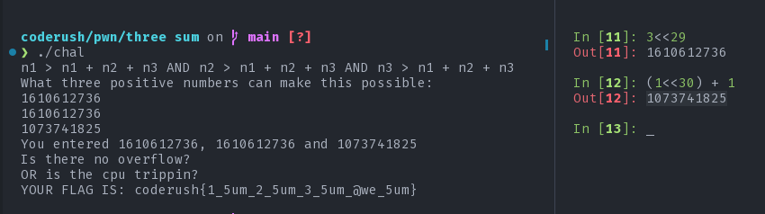

# Three Sum

#### tags: `binary exploitation` `integer overflow`

## Description

I hope ye'all have done [this](https://play.picoctf.org/events/72/challenges/challenge/382) challenge where you sum up two numbers. But don't you think that `three` makes a lot more sense than `two`? We will make things right by adding up three numbers to make it awe sum.

Access the server with: `nc 139.59.0.163 3555`

**flag format:** `coderush{fl4g}`

>Author: `gr007`

[chal](chal)

## Solution

We are given a binary. Let's load it into Ghidra.

<details>
    <Summary>Ghidra Black Magic</Summary>

    ```c
    int overflew(int sum,int n1,int n2,int n3){
        int r;

        if ((((n1 < 1) || (n2 < 1)) || (n3 < 1)) || (0 < sum)) {
            r = 0;
        }
        else {
            r = 1;
        }
        return r;
    }

    int main(void){
        int s;
        long in_FS_OFFSET;
        uint n1;
        uint n2;
        uint n3;
        int sum;
        FILE *file;
        char flag [72];
        long local_10;

        local_10 = *(in_FS_OFFSET + 40);
        puts("n1 > n1 + n2 + n3 AND n2 > n1 + n2 + n3 AND n3 > n1 + n2 + n3");
        fflush(stdout);
        puts("What three positive numbers can make this possible: ");
        fflush(stdout);
        s = __isoc99_scanf(&DAT_0010207d,&n1);
        if (s != 0) {
            s = __isoc99_scanf(&DAT_0010207d,&n2);
            if (s != 0) {
                s = __isoc99_scanf(&DAT_0010207d,&n3);
                if (s != 0) {
                    printf("You entered %d, %d and %d\n",n1,n2,n3);
                    fflush(stdout);
                    sum = n3 + n1 + n2;
                    s = overflew(sum,n1,n2,n3);
                    if (s != 0) {
                        puts("You have an integer overflow.");
                        fflush(stdout);
                        /* WARNING: Subroutine does not return */
                        exit(0);
                    }
                    puts("Is there no overflow?");
                    puts("OR is the cpu trippin?");
                    fflush(stdout);
                    if ((((sum < n1) && (sum < n2)) && (sum < n3)) &&
                    (((0 < n1 && (0 < n2)) && (0 < n3)))) {
                        file = fopen("flag.txt","r");
                        if (file == NULL) {
                            puts("flag not found.");
                            puts(
                                "If you are running this on the remote server, contact the admin immedia tely."
                                );
                            puts(
                                "If you are running this on your local machine, create a flag.txt with a  dummy flag for debugging purpose."
                                );
                            fflush(stdout);
                        /* WARNING: Subroutine does not return */
                            exit(0);
                        }
                        fgets(flag,59,file);
                        printf("YOUR FLAG IS: %s\n",flag);
                        fflush(stdout);
                        /* WARNING: Subroutine does not return */
                        exit(0);
                    }
                    puts("Then again, where is the flag?");
                }
            }
        }
        if (local_10 != *(in_FS_OFFSET + 40)) {
                        /* WARNING: Subroutine does not return */
            __stack_chk_fail();
        }
        return 0;
    }
    ```
</details>


The program does nothing out of ordinary. It takes Three integers as input, adds them up and checks if the result has caused any overflow or not with the `overflew` function. The way it checks for overflow is by the following condition: `(((n1 < 1) || (n2 < 1)) || (n3 < 1)) || (0 < sum)`. So, by this function, overflow occurs if either the sum is less than 0 or any one of the numbers is less than 1. By sane logic it might be hard to get that how can you add three poisitive integers greater than 0 but still get a sum greater than zero that is somehow less than any one of the integers that were added. But if we talk about computers, `meh`.

Integers are 32 bit long. if the result is to be greater than zero then the `sign` bit needs to be zero in the result. Now, how can we do it?
Let's look at the following example for 8 bit signed integer:

`0b01100000` => `n1`

`0b01100000` => `n2`

`0b01000000` => `n3`

`0b00000000` => `sum`

how this happens? well the original result would be: `0b100000000` in `9` bit. But the extra 1 has to be removed. Now, we are left with only 0 as sum. Thus having sum less than any of the given numbers and also the sum being greater than 0. The same logic applies for 32bit integers. So, to get 0 as sum, we need any three positive numbers whose sum add up to at least `2<<32 + 1` as the sum needs to be greater than zero.

