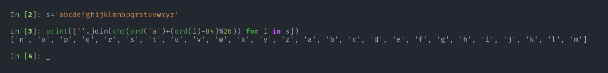
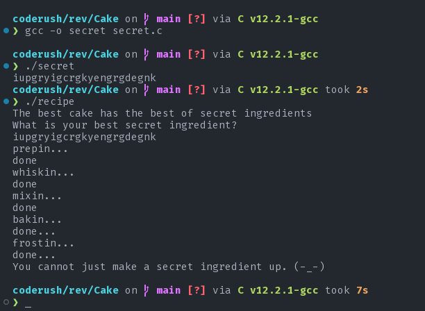
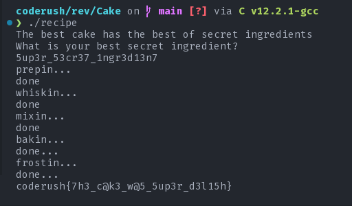

# Chocolate Cake

#### tags: `rev`

## Description

I found the best [recipe](recipe) for Cake in the world. But this recipe needs a secret ingredient which I don't
know. Help me discover the hidden secrets of this recipe and I will make the best cake for you.

You can access the kitchen with `nc 139.59.0.163 1740`

**flag format:** `coderush{fl4g}`

>Author: `gr007`

## Solution

The recipe wants a secret ingredient when executed. Let's see what we can see in Ghidra.
I have done some light renaming and so on. now let's try to recreate the recipe. It's pretty amazing how much similar the decompiled source is compared to the actual source code.

### Ghidra black magic

<details>
    <Summary>recipe from ghidra</Summary>

    ```c
    byte taste_cake(char *cake)

    {
        int i;
        char some_cake [23];
        byte f;

        some_cake._0_8_ = 0x1070426e70144e3c;
        some_cake._8_7_ = 0x5413116e370e29;
        some_cake[15] = 0x74;
        some_cake._16_7_ = 0x6a356833540227;
        f = 1;
        for (i = 0; i < secret_len; i += 1) {
            f &= cake[i] == some_cake[i];
        }
        if (*(in_FS_OFFSET + 40) != *(in_FS_OFFSET + 40)) {
                        /* WARNING: Subroutine does not return */
            __stack_chk_fail();
        }
        return f;
    }

    void serve_the_cake(char *cake)

    {
        int tasty;
        FILE *file;
        long in_FS_OFFSET;
        char flag [72];
        long local_10;

        local_10 = *(in_FS_OFFSET + 40);
        tasty = taste_cake(cake);
        if (tasty != 1) {
            puts("You cannot just make a secret ingredient up. (-_-)");
                        /* WARNING: Subroutine does not return */
            exit(0);
        }
        file = fopen("flag.txt","r");
        if (file == NULL) {
            puts("file not found\n");
            puts("If you are on a remote server contact the admin asap.");
            puts("If you are on your local machine, create a flag.txt so that you can debug easily.");
                        /* WARNING: Subroutine does not return */
            exit(1);
        }
        fgets(flag,64,file);
        puts(flag);
        if (local_10 != *(in_FS_OFFSET + 40)) {
                        /* WARNING: Subroutine does not return */
            __stack_chk_fail();
        }
        return;
    }

    void bake_and_frost(char *secret_ingredient)

    {
        int i;
        int j;

        puts("bakin...");
        puts("done...");
        for (i = 0; i < 2 << (secret_len & 31); i += 1) {
            for (j = 0; j < secret_len; j += 1) {
                secret_ingredient[j] =
                    secret_ingredient[j] ^ secret_ingredient[(j + secret_len + -1) % secret_len];
            }
        }
        puts("frostin...");
        puts("done...");
        return;
    }

    void whisk_and_mix(char *secret_ingredient)

    {
        int i;
        int j;
        int k;

        puts("whiskin...");
        puts("done");
        for (i = 0; i < secret_len / 2; i += 1) {
            for (j = 0; j < secret_len; j += 1) {
                secret_ingredient[j] =
                    secret_ingredient[j] ^ secret_ingredient[(j + secret_len + -1) % secret_len];
                k = (j + secret_len + -1) % secret_len;
                secret_ingredient[k] = secret_ingredient[k] ^ secret_ingredient[j];
                secret_ingredient[j] =
                    secret_ingredient[j] ^ secret_ingredient[(j + secret_len + -1) % secret_len];
            }
        }
        puts("mixin...");
        puts("done");
        return;
    }

    void prepare(char *secret_ingredient)

    {
        int i;

        puts("prepin...");
        for (i = 0; i < secret_len; i += 1) {
            secret_ingredient[i] =
                secret_ingredient[i] + -84 + ((secret_ingredient[i] + -84) / 26) * -26 + 'a';
        }
        puts("done");
        return;
    }


    char * bake_a_cake(char *secret_ingredient)

    {
        long in_FS_OFFSET;
        int i;
        code *recipe [3];
        long local_10;

        local_10 = *(in_FS_OFFSET + 40);
        recipe[0] = prepare;
        recipe[1] = whisk_and_mix;
        recipe[2] = bake_and_frost;
        for (i = 0; i < 3; i += 1) {
            (*recipe[i])(secret_ingredient);
        }
        if (local_10 != *(in_FS_OFFSET + 40)) {
                        /* WARNING: Subroutine does not return */
            __stack_chk_fail();
        }
        return secret_ingredient;
    }


    int main(void)

    {
        char c;
        size_t sVar1;
        char *cake;
        long in_FS_OFFSET;
        int i;
        char secret_ingredient [40];
        long local_10;

        local_10 = *(in_FS_OFFSET + 40);
        puts("The best cake has the best of secret ingredients");
        puts("What is your best secret ingredient?");
        read(1,secret_ingredient,32);
        for (i = 0; i < 32; i += 1) {
            if (secret_ingredient[i] == '\n') {
                c = '\0';
            }
            else {
                c = secret_ingredient[i];
            }
            secret_ingredient[i] = c;
        }
        sVar1 = strlen(secret_ingredient);
        secret_len = sVar1;
        if (secret_len != 23) {
            puts("You are not someone who is supposed to know the super secret ingredient.");
                        /* WARNING: Subroutine does not return */
            exit(0);
        }
        cake = bake_a_cake(secret_ingredient);
        serve_the_cake(cake);
        if (local_10 != *(in_FS_OFFSET + 40)) {
                        /* WARNING: Subroutine does not return */
            __stack_chk_fail();
        }
        return 0;
    }

    ```
</details>

### Function breakdown

#### main

<details>
    <Summary>main</Summary>

    ```c
    int main(){
        char c;
        size_t sVar1;
        char *cake;
        long in_FS_OFFSET;
        int i;
        char secret_ingredient [40];
        long local_10;

        local_10 = *(in_FS_OFFSET + 40);
        puts("The best cake has the best of secret ingredients");
        puts("What is your best secret ingredient?");
        read(1,secret_ingredient,32);
        for (i = 0; i < 32; i += 1) {
            if (secret_ingredient[i] == '\n') {
                c = '\0';
            }
            else {
                c = secret_ingredient[i];
            }
            secret_ingredient[i] = c;
        }
        sVar1 = strlen(secret_ingredient);
        secret_len = sVar1;
        if (secret_len != 23) {
            puts("You are not someone who is supposed to know the super secret ingredient.");
                        /* WARNING: Subroutine does not return */
            exit(0);
        }
        cake = bake_a_cake(secret_ingredient);
        serve_the_cake(cake);
        if (local_10 != *(in_FS_OFFSET + 40)) {
                        /* WARNING: Subroutine does not return */
            __stack_chk_fail();
        }
        return 0;
    }
    ```
</details>

The main function takes the `secret_ingredient` using read function. Then checks for length. So, we know that the length of the secret_ingredient is 23. then there is a call to `bake_a_cake(secret_ingredient)`. the function returns a `cake` and the `cake` is then served by `serve_the_cake(cake)` function. We now write a function that will do the opposite of what the main function does in another main function.
```c
int main(){
    char* cake = get_a_cake();  //get the cake from serve_the_cake(cake) function
    char* secret_ingredient = cake_a_bake(cake);
    preserve(secret_ingredient);
}
```
As we saw in `serve_the_cake` function, the function compares the output of `bake_a_cake` with a premade cake inside `taste_cake` and returns 1 or 0. so, we can later just take the cake from taste_cake function and find out the secret_ingredient from the cake.

#### bake_a_cake

<details>
    <Summary>bake_a_cake</Summary>

    ```c
    char* bake_a_cake(char* secret_ingredient){
        long in_FS_OFFSET;
        int i;
        code *recipe [3];
        long local_10;

        local_10 = *(in_FS_OFFSET + 40);
        recipe[0] = prepare;
        recipe[1] = whisk_and_mix;
        recipe[2] = bake_and_frost;
        for (i = 0; i < 3; i += 1) {
            (*recipe[i])(secret_ingredient);
        }
        if (local_10 != *(in_FS_OFFSET + 40)) {
                        /* WARNING: Subroutine does not return */
            __stack_chk_fail();
        }
        return secret_ingredient;
    }
    ```
</details>

It has an interesting type that is `code*` for those of you who do not know, `code*` is basically a function pointer. How code pointer is function pointer is not the part of discussion. This function first initializes an array of function pointers with addresses of functions in order. Then using a for loop, the functions are being called by giving the secret_ingredient as a parameter to the function. These functions use the secret_ingredient and then returns the secret ingredient as cake. Now, let's write a function that will take a `cake` as input and will give a `secret_ingredient` as output.

```c
char* cake_a_bake(char* cake){
    void (*recipe[3])(char*) = {defrost_and_dake, seperate_and_dwadle, wait};
    for(int i = 0; i< 3; i++){
        (*recipe[i])(cake);
    }
    return cake;
}
```

#### prepare

<details>
    <Summary>prepare</Summary>

    ```c
    char* prepare(char* secret_ingredient){
        int i;

        puts("prepin...");
        for (i = 0; i < secret_len; i += 1) {
            secret_ingredient[i] =
                secret_ingredient[i] + -84 + ((secret_ingredient[i] + -84) / 26) * -26 + 'a';
        }
        puts("done");
        return;
    }
    ```
</details>

we see a loop that modifies our secret_ingredient. At first, it looks like whatever is happening inside the loop  does not look good. But if you look closely, if we take `secret_ingredient[i]-84` as `z`, the expression becomes:
```c
secret_ingredient[i] = z - (z / 26) * 26 + 'a'
```
I don't know if any of you ever found reminder using the above method, but i did. We can rewrite the above expression as follows:
```c
secret_ingredient[i] = z % 26 + 'a'
```
Now, seeing 26 as the constant, we can assume that the output of `secret_igredient[i]` is also going to be a character but something added to 'a'. Now, let's breakdown `z`.

`z = secret_ingredient[i] - 84`

I wanted to see what happens to the characters after this whole transformation of `prepare` function. Look what I found:



The function does `rot13` on each characters. so, another simple rot13 would bring back the input from the output.
Now, it's time to write `wait` function as designed by cake_a_bake function:
```c
void wait(char* cake){
    for(int i=0;i<secret_len;i++){
        cake[i] = 'a' + (cake[i]-84)%26;
    }
}
```

#### whisk_and_mix

<details>
    <Summary>whisk_and_mix</Summary>

    ```c
    void whisk_and_mix(char* secret_ingredient){
        int i;
        int j;
        int k;

        puts("whiskin...");
        puts("done");
        for (i = 0; i < secret_len / 2; i += 1) {
            for (j = 0; j < secret_len; j += 1) {
                secret_ingredient[j] =
                    secret_ingredient[j] ^ secret_ingredient[(j + secret_len + -1) % secret_len];
                k = (j + secret_len + -1) % secret_len;
                secret_ingredient[k] = secret_ingredient[k] ^ secret_ingredient[j];
                secret_ingredient[j] =
                    secret_ingredient[j] ^ secret_ingredient[(j + secret_len + -1) % secret_len];
            }
        }
        puts("mixin...");
        puts("done");
        return;
    }
    ```
</details>

Our secret_len/2 is 11. so, the outer loop loops 11 times. the inner loop runs for every characters in the secret_ingredient. Let's see what happens in the inner loop after cleaning a bit:
```c
k = (j+secret_len -1) % secret_len;
secret_ingredient[j] ^= secret_ingredient[k];
secret_ingredient[k] ^= secret_ingredient[j];
secret_ingredient[j] ^= secret_ingredient[k];
```
for j=0; k=secret_len-1; and the inside working is inplace swapping of the jth character with it's previous character. So, after swapping all characters in the inner loop, the whole secret_ingredient is cyclic shifted left by one character. And it occurs 11 times. So, to revert our original secret ingredient, we need to cyclic right shift 11 times. The `separate_and_dwadle` function can be written as:

```c
void separate_and_deadle(char* cake){
    for(int i=0;i<secret_len/2;i++){
        for(int j=secret_len-1;j>=0;j--){
            k = (j+secret_len -1) % secret_len;
            cake[j] ^= cake[k];
            cake[k] ^= cake[j];
            cake[j] ^= cake[k];
        }
    }
}
```


#### bake_and_frost

<details>
    <Summary>bake_and_frost</Summary>

    ```c
    void bake_and_frost(char* secret_ingredient){
        int i;
        int j;

        puts("bakin...");
        puts("done...");
        for (i = 0; i < 2 << (secret_len & 31); i += 1) {
            for (j = 0; j < secret_len; j += 1) {
                secret_ingredient[j] =
                    secret_ingredient[j] ^ secret_ingredient[(j + secret_len + -1) % secret_len];
            }
        }
        puts("frostin...");
        puts("done...");
        return;
    }
    ```
</details>

The bake and frost function does the following to every characters of the secret_ingredient from first to last 2^23 times:
```c
secret_ingredient[j] ^= secret_ingredient[(j + secret_len - 1) % secret_len];
```
Each char in secret_ingredient is xored with it's previous char. To reverse this, we write the following function:
```c
void defrost_and_dake(char* cake){
    for(int i=0;i<(2<<23);i++){
        for(int j=secret_len-1;j>=0;j--){
            cake[i] ^= cake[(j + secret_len - 1) % secret_len];
        }
    }
}
```

#### serve_the_cake and taste_cake

<details>
    <Summary>serve_the_cake</Summary>

    ```c
    void serve_the_cake(char* cake){
        int tasty;
        FILE *file;
        long in_FS_OFFSET;
        char flag [72];
        long local_10;

        local_10 = *(in_FS_OFFSET + 40);
        tasty = taste_cake(cake);
        if (tasty != 1) {
            puts("You cannot just make a secret ingredient up. (-_-)");
                        /* WARNING: Subroutine does not return */
            exit(0);
        }
        file = fopen("flag.txt","r");
        if (file == NULL) {
            puts("file not found\n");
            puts("If you are on a remote server contact the admin asap.");
            puts("If you are on your local machine, create a flag.txt so that you can debug easily.");
                        /* WARNING: Subroutine does not return */
            exit(1);
        }
        fgets(flag,64,file);
        puts(flag);
        if (local_10 != *(in_FS_OFFSET + 40)) {
                        /* WARNING: Subroutine does not return */
            __stack_chk_fail();
        }
        return;
    }
    ```
</details>

this function is our target. upon successfully getting 1 from taste_cake, we will recieve the flag.txt from the server.

<details>
    <Summary>taste_cake</Summary>

    ```c
    byte taste_cake(char* cake){
        int i;
        char some_cake [23];
        byte f;

        some_cake._0_8_ = 0x1070426e70144e3c;
        some_cake._8_7_ = 0x5413116e370e29;
        some_cake[15] = 0x74;
        some_cake._16_7_ = 0x6a356833540227;
        f = 1;
        for (i = 0; i < secret_len; i += 1) {
            f &= cake[i] == some_cake[i];
        }
        if (*(in_FS_OFFSET + 40) != *(in_FS_OFFSET + 40)) {
                        /* WARNING: Subroutine does not return */
            __stack_chk_fail();
        }
        return f;
    }
    ```
</details>

Though it feels weird, the 23 consecutive bytes in some_cake needs to be extracted byte by byte for us to reconstruct the cake. We have to take note of endianness and reverse each 8 bytes to get the correct order.

Now, the `get_cake` function will be as follows:
```c
char* get_cake(){
    char* some_cake = (char*)malloc(sizeof(char) * 23);
    some_cake[0] = 0x3c;
    some_cake[1] = 0x4e;
    some_cake[2] = 0x14;
    some_cake[3] = 0x70;
    some_cake[4] = 0x6e;
    some_cake[5] = 0x42;
    some_cake[6] = 0x70;
    some_cake[7] = 0x10;
    some_cake[8] = 0x29;
    some_cake[9] = 0x0e;
    some_cake[10] = 0x37;
    some_cake[11] = 0x6e;
    some_cake[12] = 0x11;
    some_cake[13] = 0x13;
    some_cake[14] = 0x54;
    some_cake[15] = 0x74;
    some_cake[16] = 0x27;
    some_cake[17] = 0x02;
    some_cake[18] = 0x54;
    some_cake[19] = 0x33;
    some_cake[20] = 0x68;
    some_cake[21] = 0x35;
    some_cake[22] = 0x6a;
    return some_cake;
}
```
We now pass the cake to cake_a_bake and then get a secret_ingredient. we then preserve the secret_ingredient.

```c
void preserve(char* secret_ingredient){
    for(int i=0; i<secret_len;i++){
        printf("%c",secret_ingredient[i]);
    }
}
```

Now, we have all the required to retrieve the secret_ingredient from the cake. the following c file computes the secret_ingredient from the cake.

[secret](secret.c)

Now, we hit a wall of disappointment.



We can assume that we messed up somewhere bigtime. But upon further observation of the reversal code, everything seems to be okay. But there is a catch. all the letters in the input are rotated whether they are between `a` and `z` or not. My guess is that there were some characters in the secret_ingredient that were not in the range `a~z` so, rot13 becomes reversible for only those who were between `a~z` and irreversible for those who were not. Now, we change the secret code a little in our recipe, we do the following:
```c
char* cake_a_bake(char* cake){
    void (*recipe[3])(char*) = {defrost_and_dake, seperate_and_dwadle, wait};
    for(int i = 0; i< 2; i++){
        (*recipe[i])(cake);
    }
    return cake;
}
```
This way, we will now get the secret ingredient before it was rotated.
The string we get is: `\hcZel\ZpeZ^lXateZqXZa^` we head over to cyberchef and only do rot13 on characters.

The string we get is: `\upMry\McrM^yKngrMdKMn^`

The previous secret we go was: `iupgryigcrgkyengrgdegnk`

If we compare the two, we can see that some characters appear at exactly the same position as the other one. Now, we keep them as they are highly likely the original characters, not the 1337 converted to characters. `_up_ry__cr__y_ngr_d__n_`.

Not too clear what it exactly means. Now, we need to make a cake of only most probable 1337 codes to guess what 1337 code was used for the recipe. We make the following change in the code of 1 `cake_a_bake`:

When we put `134570!@_` in wait, we get the following output: `XZ[\^WHMl`; Now, we can replace occurances of any of `XZ[\^WHMl` with it's corresponding 1337 code in `\hcZel\ZpeZ^lXateZqXZa^`. After adding it with `_up_ry__cr__y_ngr_d__n_` we get: `5up3ry53cr37y1ngr3d13n7`. aslo, see that both `l` and `_` are converted to `y` upon rot13. so, we can safely assume that the secret was: `5up3r_53cr37_1ngr3d13n7`.

Annd voila we got our flag:



##### flag: `coderush{7h3_c@k3_w@5_5up3r_d3l15h}`