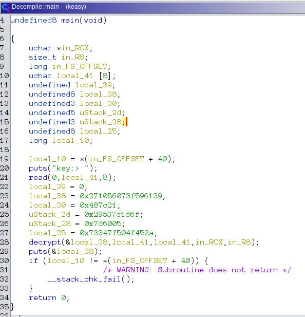
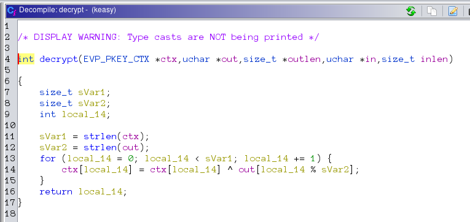

# Keasy

## Solution

Let's use ghidra to look at the function with power of CIA.





We can see that the encryption or decryption in place is simple xor cicle. Now the tricky part is there is no clue given as to what we need to xor with to get the original flag or the key. As if one can be obtained, the other unknown can be obtained by simply xoring them.
```c
x ^ y = z
z ^ x = y
y ^ z = x
```
But we have another clue in the shadows though. The flag format is `coderush{flag}` we can see that the first 8 
characters of the flag will be `coderush`. And also the key is also 8 chars long. So, the first 8 bytes of the encrypted 
flag i.e, `0x271056073f596139` can be xored with 'coderush' to get the key and we can then pass the key to the program 
who will give us the full flag.

The following c [program](sol.c) will find out the key:

```c
#include <stdio.h>

void solve(char* a, char* b, int len) {
    for (int i = 0; i < len; i++) {
        printf("%c",a[i]^b[i]);
    }
}

int main() {
    long bytes = 0x271056073f596139;
    char known[] = "coderush";
    solve(&bytes,known,8);
}
```
After compiling the program, we run the program and pipe the output to keasy.
```bash
./sol | ./keasy
```
## Flag: `coderush{ru5h_0f_n@p0l30n}`

